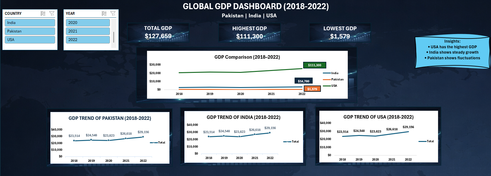
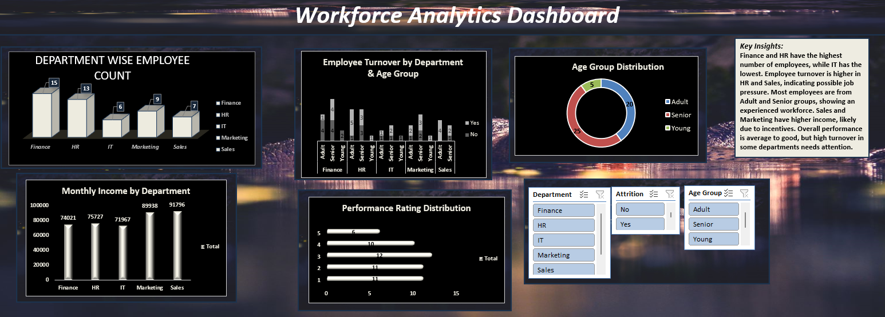
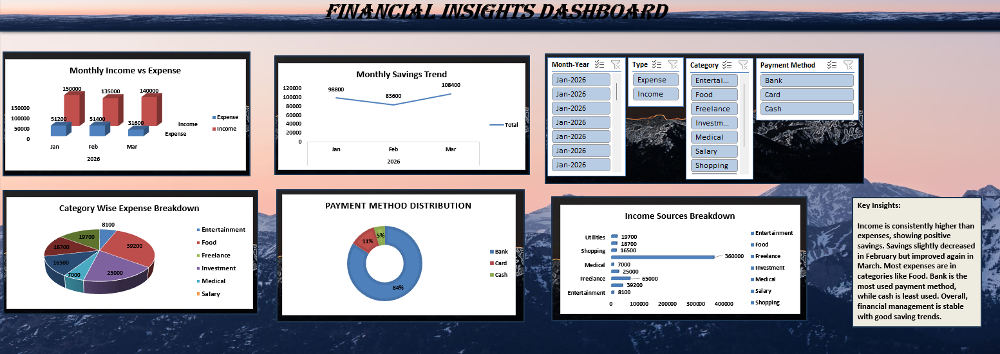
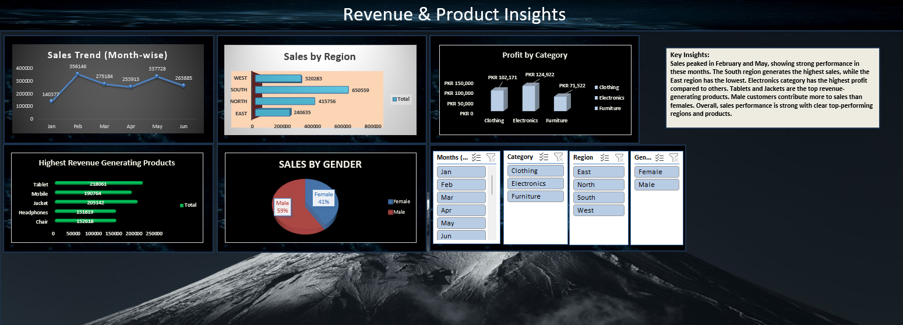

# Data-Analytics-portfolio
EExcel & Power BI Dashboards showcasing data analysis skills
## Excel Projects

### GDP Dashboard

### HR Analytics Dashboard

### Personal Finance Dashboard

### Sales Performance Dashboard

---

## Power BI Projects

### Bank Customer Behavior & Insights

### Pakistan Inflation Analysis

### Stock Performance Overview

---

## Tools Used
- Excel (Pivot Tables, Charts, Dashboards)
- Power BI (Data Modeling, DAX, Visualization)

---

## About Me
Aspiring Data Analyst skilled in Excel and Power BI, focused on turning data into actionable insights.
